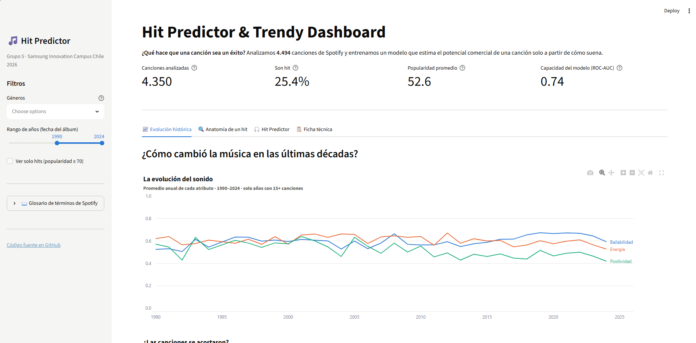
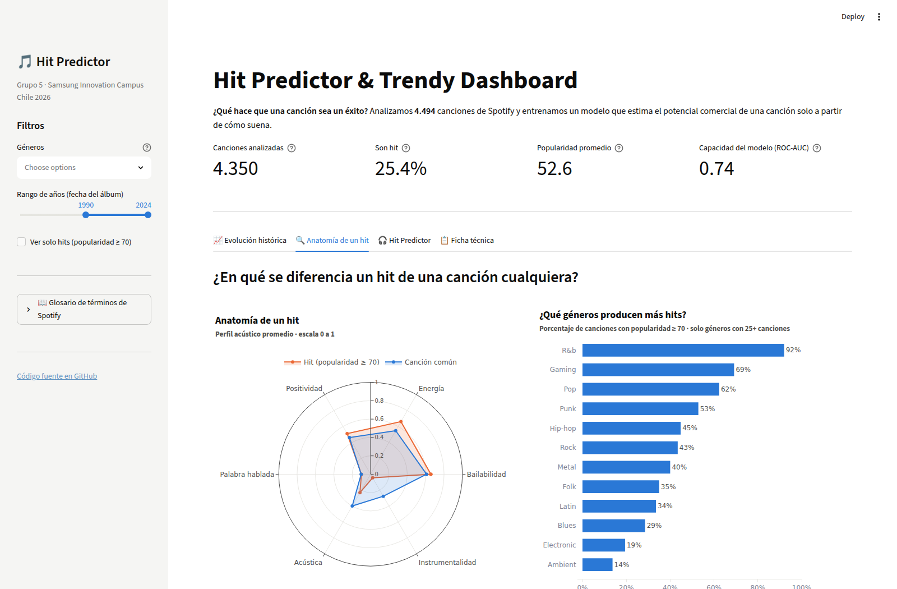
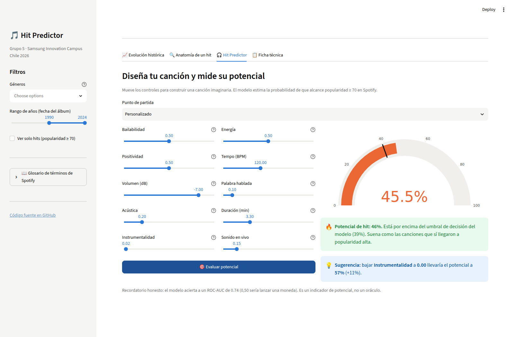
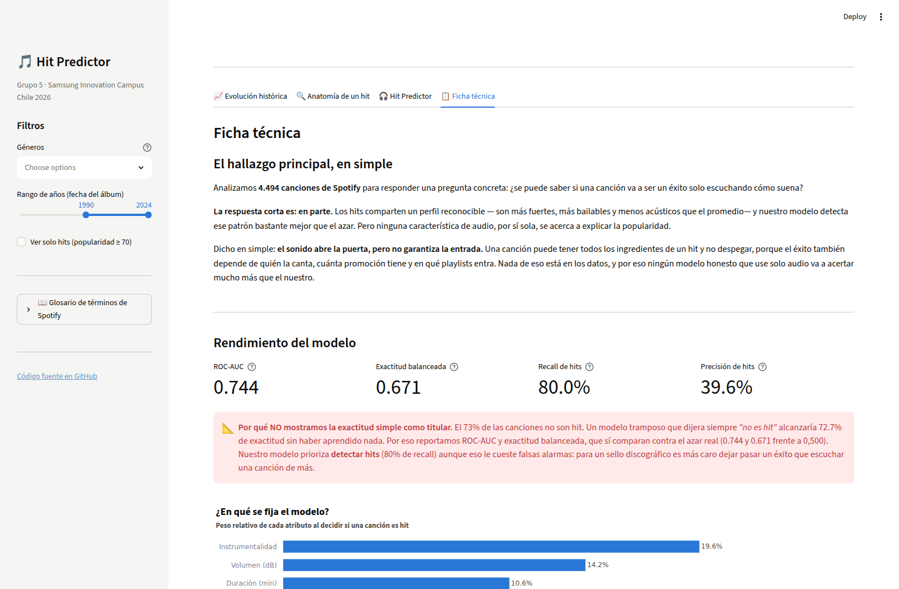

# 🎵 Hit Predictor & Trendy Dashboard — Grupo 5

Aplicación interactiva que analiza qué características de audio distinguen a una
canción exitosa en Spotify, y estima el potencial comercial de una canción
imaginaria con un modelo de Machine Learning.

**Samsung Innovation Campus Chile 2026 — Cohort 2 · Código y Programación**

🔗 **App publicada:** [_Streamlit App_](https://hit-predictor-spotify.streamlit.app)
🔗 **Repositorio:** [ GitHub Repo ](https://github.com/Kemtojp/hit-predictor-spotify)
---

## ❓ Pregunta de análisis

> **¿Se puede saber si una canción va a ser un éxito solo a partir de cómo suena?**

Y como preguntas de apoyo: ¿cambió el sonido de la música popular en las últimas
décadas?, ¿qué diferencia el perfil acústico de un hit del de una canción común?

---

## 💡 Hallazgos principales

1. **El sonido abre la puerta, pero no garantiza la entrada.** Ninguna característica
   de audio se correlaciona fuerte con la popularidad: la más alta es el volumen, con
   apenas **0,20**. Cómo suena una canción explica solo una parte pequeña de su éxito.
2. **Aun así, los hits tienen un perfil reconocible:** son más fuertes, más bailables
   y menos acústicos que el promedio. Un modelo entrenado solo con audio alcanza un
   **ROC-AUC de 0,744** — muy por encima del azar (0,50), pero lejos de ser un oráculo.
3. **La música se volvió menos alegre.** Desde 2010 la *positividad* (valence) promedio
   cae de forma sostenida, mientras la *bailabilidad* sube.
4. **El género importa tanto como el sonido.** La tasa de hits va del 92% en R&B al 14%
   en ambient, con perfiles acústicos que se solapan.

---

## 🧩 Módulos de la aplicación

| Pestaña | Qué muestra |
|---|---|
| 📈 **Evolución histórica** | Cómo cambiaron bailabilidad, energía, positividad y duración año a año (1990–2024). |
| 🔍 **Anatomía de un hit** | Radar comparando el perfil acústico promedio de un hit vs. una canción común, tasa de hits por género y matriz de correlación. |
| 🎧 **Hit Predictor** | Simulador con 10 controles deslizantes: arma una canción imaginaria y el modelo calcula su probabilidad de ser hit, más una sugerencia de qué ajustar. |
| 📋 **Ficha técnica** | Hallazgo principal en lenguaje no técnico, métricas del modelo frente al baseline, importancia de cada atributo, dataset y equipo. |

La **barra lateral** incluye filtros por género, rango de años y un interruptor de
"solo hits", además de un glosario de los términos de Spotify.

---

## 📊 Dataset

- **Fuente:** [Spotify Music Dataset](https://www.kaggle.com/datasets/solomonameh/spotify-music-dataset)
  (autor: *solomonameh*, Kaggle), combinando los archivos de alta y baja popularidad.
- **Licencia:** Open Database License
- **Volumen:** 4.494 canciones únicas tras limpieza (sin duplicados ni nulos).
- **Variable objetivo:** `is_hit = 1` cuando la popularidad de Spotify es ≥ 70.
- **Balance de clases:** 27,3% hits · 72,7% no hits.

### Limitación conocida que asumimos

`track_album_release_date` es la fecha del **álbum**, no del lanzamiento original: las
reediciones y remasterizaciones aparecen con fecha moderna. Además, el dataset tiene
solo 11 canciones anteriores a 1970 frente a 2.800 de la década de 2020. Por eso los
gráficos de evolución **empiezan en 1990** y solo grafican años con 15 o más canciones:
un promedio calculado sobre 3 canciones no es una tendencia, es ruido.

---

## 🤖 El modelo

| | |
|---|---|
| Algoritmo | `RandomForestClassifier` (scikit-learn), elegido por validación cruzada de 5 pliegues frente a una regresión logística |
| Variables de entrada | 10 atributos de audio (ver `models/features.pkl`) |
| División | 3.595 entrenamiento / 899 prueba, estratificada |
| Umbral de decisión | 0,39 — optimiza exactitud balanceada, no el 0,50 por defecto |

### Resultados sobre el conjunto de prueba

| Métrica | Valor | Referencia |
|---|---|---|
| **ROC-AUC** | **0,744** | 0,500 = azar |
| **Exactitud balanceada** | **0,671** | 0,500 = azar |
| Recall de hits | 80,0% | detecta 8 de cada 10 hits reales |
| Precisión de hits | 39,6% | cuando dice "hit", acierta 4 de cada 10 |
| Accuracy simple | 61,3% | baseline: 72,7% |

> **Por qué no usamos la accuracy como titular.** El 72,7% de las canciones no son hit,
> así que un modelo que dijera siempre *"no es hit"* alcanzaría 72,7% de accuracy sin
> haber aprendido nada. Por eso reportamos ROC-AUC y exactitud balanceada, que sí se
> comparan contra el azar real. Nuestro umbral prioriza **detectar hits** aunque genere
> falsas alarmas: para un sello discográfico es más caro dejar pasar un éxito que
> escuchar una canción de más. El razonamiento completo está en
> `notebooks/03_model_retraining.ipynb`.

---

## 🚀 Cómo ejecutar la app

```bash
git clone https://github.com/Kemtojp/hit-predictor-spotify.git
cd Grupo5_
python -m venv .venv
source .venv/bin/activate        # en Windows: .venv\Scripts\activate
pip install -r requirements.txt
streamlit run app.py
```

La app queda disponible en `http://localhost:8501`.

> 📘 **¿Primera vez?** `GUIA.md` tiene la instalación paso a paso para Windows y macOS,
> el flujo completo de los datos, un recorrido por cada archivo y la solución de los
> errores más comunes.

Para reentrenar el modelo desde cero:

```bash
python notebooks/train_model.py
```

---

## 📁 Estructura del proyecto

```
.
├── app.py                              # Dashboard de Streamlit (4 módulos)
├── charts.py                           # Funciones de visualización en Plotly
├── GUIA.md                             # Guía completa: instalación y recorrido del código
├── requirements.txt
├── .streamlit/config.toml              # Tema claro fijo
├── data/
│   ├── high_popularity_spotify_data.csv
│   ├── low_popularity_spotify_data.csv
│   └── spotify_clean.csv               # Dataset limpio (4.494 filas)
├── models/
│   ├── model.pkl                       # Modelo entrenado
│   ├── features.pkl                    # Orden de las variables (contrato con la app)
│   └── metrics.json                    # Métricas que la app muestra en la Ficha técnica
├── notebooks/
│   ├── 01_data_cleaning.ipynb          # Limpieza y creación de is_hit
│   ├── 02_model_training.ipynb         # Primer modelo
│   ├── 03_model_retraining.ipynb       # Baseline, métricas correctas y umbral
│   └── train_model.py                  # Versión ejecutable del notebook 03
└── docs/
    ├── modelo.md
    └── sliders_referencia.md
```

---

## ✅ Requisitos mínimos del curso

| Requisito | Cómo se cumple |
|---|---|
| 3+ visualizaciones | 6: evolución de atributos, evolución de duración, radar, tasa de hits por género, matriz de correlación, importancia de variables |
| 2+ controles interactivos | Multiselect de géneros, slider de años, checkbox de solo hits, selector de preset, 10 sliders del simulador, botón de evaluación |
| 3+ indicadores | Canciones analizadas, % de hits, popularidad promedio y ROC-AUC en el encabezado, más 4 métricas en la Ficha técnica |
| Explicación no técnica | Sección *"El hallazgo principal, en simple"* en la Ficha técnica |
| Dataset real con fuente citada | Kaggle, enlazado arriba y dentro de la app |
| Publicación | [_Streamlit App_](https://hit-predictor-spotify.streamlit.app) |

---

## 👥 Equipo

| Integrante | Rol |
|---|---|
| Jeancarlo Cuesta | Data Engineer — limpieza del dataset |
| Dante | ML Engineer — entrenamiento del modelo |
| Carolina Naranjo | Visualization Specialist — gráficos en Plotly |
| Luis Rojas | App Architect — dashboard en Streamlit |
| Juan Velásquez | Git, documentación y presentación |

---

## 📸 Capturas

### Evolución histórica


### Anatomía de un hit


### Hit Predictor


### Ficha técnica

